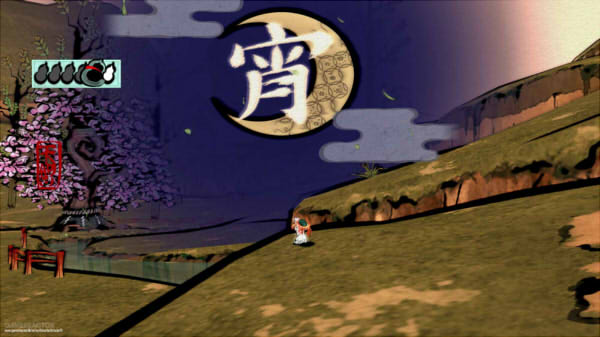
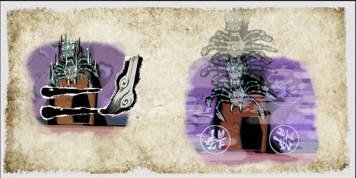
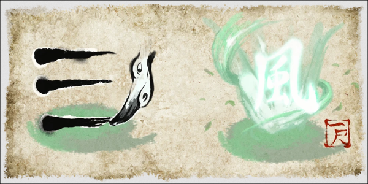

___
# Design Journal: Conceptualizing
March 7th, 2024
 
Journal about your ideation process. Include any Design Values, Precedents, and your 3 favourite ideas. These don't have to be very detailed, just a few sentences to capture the main game concept.

## Conceptualizing: The Beginning
Before March break, we each had to do a conceptualizing exercise to come up with a list of game concepts. I mainly went with a mix of games that I enjoy playing and topics I would be interested in making. I’ve always been stuck on aesthetics and struggled to make meaningful work… so to make one, providing a theme and a good play experience can carry that. In addition, bringing emotion to the work can also help complement these 2 design values. Lastly, by adopting a minimal aesthetic, I can distribute the workload involved in developing the game.

### Idea 1
The first idea I had was to make a strategic rhythm game using color codes to manipulate creature behavior.
- **Comments:**
  - Designing creatures, coming up with all the behaviors of the animals, as well as timing to the beat would all be too ambitious for me to tackle in such a short period of time.

### Idea 2
The second idea (from combining a partner’s word) was a game set in a farm or slaughterhouse, chopping animals to the beat.
- **Comments:**
  - This idea seems more approachable than the first. The rhythm aspect contrasted with a slaughterhouse is quite dark, perhaps hinting at the inevitable end of the farm animals.
  - The rhythm aspect is still a bit too ambitious with the time frame I have, but it is a concept I would like to give it a try in the future.

### Idea 3
The third idea (from combining a partner’s word) was a game that uses colors as a communication tool to “decode” and manage emotions.
- **Comments:**
  - I have been attracted to color theory since my art journey and I think it could be used as an effective game mechanic in relation to understanding human emotions.
  - I've decided to focus on this concept in the upcoming weeks, acknowledging that it may not be perfect but holds personal significance for me.

___

# Design Journal: Game Analysis
March 7th, 2024
 
Design Journal: Game Analysis - Find a game that you know well or are interested by. What decisions have the designers made that cause the game to be interesting? Where have they failed? Think mechanically rather than thematically. What ideas/methods/techniques do you think you could borrow for future projects?

## Game Analysis: Okami

Okami was one of my favorite games on the Wii console when it first came out. It's a game that falls into a mix of action, adventure, platform, and puzzle game genres. While my gaming experience was limited, it had unique game mechanics and gameplay like no other. For context, the story is set in Nippon, where you are the reincarnated God called Amaterasu, controlled as a wolf. The premise of the game is to collect all the brush techniques that you have lost and use them to fight off evil. 

### Interesting Points
- The brush mechanic
  - Amaterasu's tail is shaped like a brush which you can use to **draw** attacks on enemies. As a young teen, being able to manipulate my surroundings always fascinated me. You could draw a sun at night to create day, slice enemies with a stroke of a brush, slow time, or break through walls by dropping bombs. Even though you can "punch and kick" like in typical combat, the celestial brush provides for a dynamic play, both for combat and solving puzzles.
  - As a bonus, you can even sprout trees to stun enemies or pee on them to receive extra rewards. The incorporation of humor adds to the charm of Okami as well!
- Another interesting point is that most of the time, the difficulty of the game isn't about trying to survive, but about getting more rewards by ridding enemies the quickest and most **skillfully** as possible. 

### Flaws
 - Due to the amount of brush techniques to be learned in the game (about 13+), similarities in stroke design should be avoided. For example, both "Veil of Mist" and "Whirlwind" require the player to draw horizontal lines to activate the techniques, but one slows down time while the other creates a tornado. When the system misinterprets these brush strokes, it can cause lots of frustration- especially during a heated battle.

### For Inspiration...
- To incorporate some of these ideas in my future projects, I'd like to consider variety in gameplay. For example, I could match different actions to each of their corresponding opponents' colors or introduce different characters that have different playing styles. (If I do have time, I'd like to think a bit more about the choice of visual narrative as well.)

