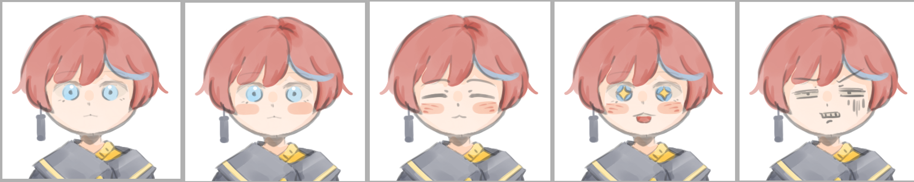
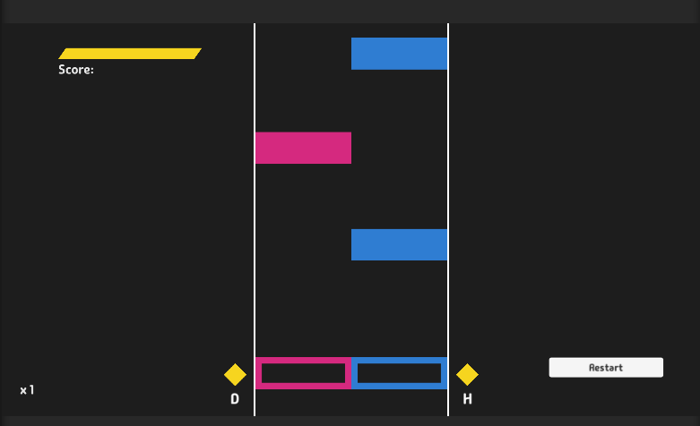
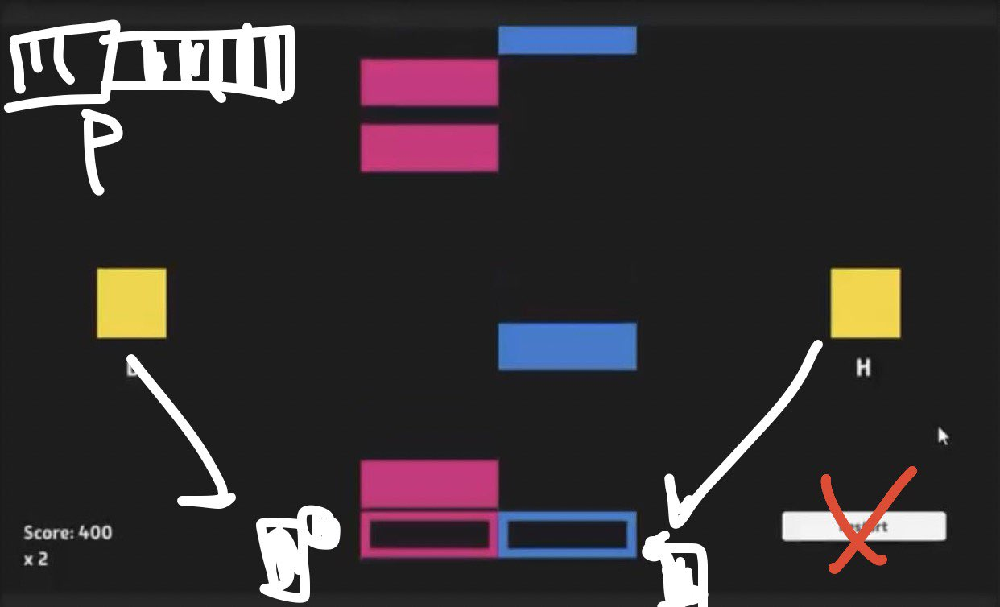
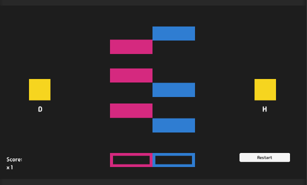
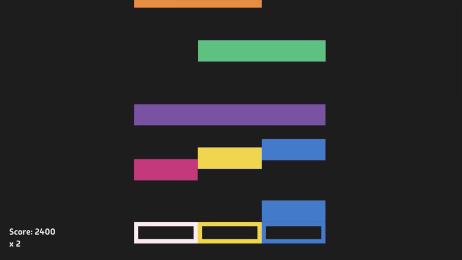
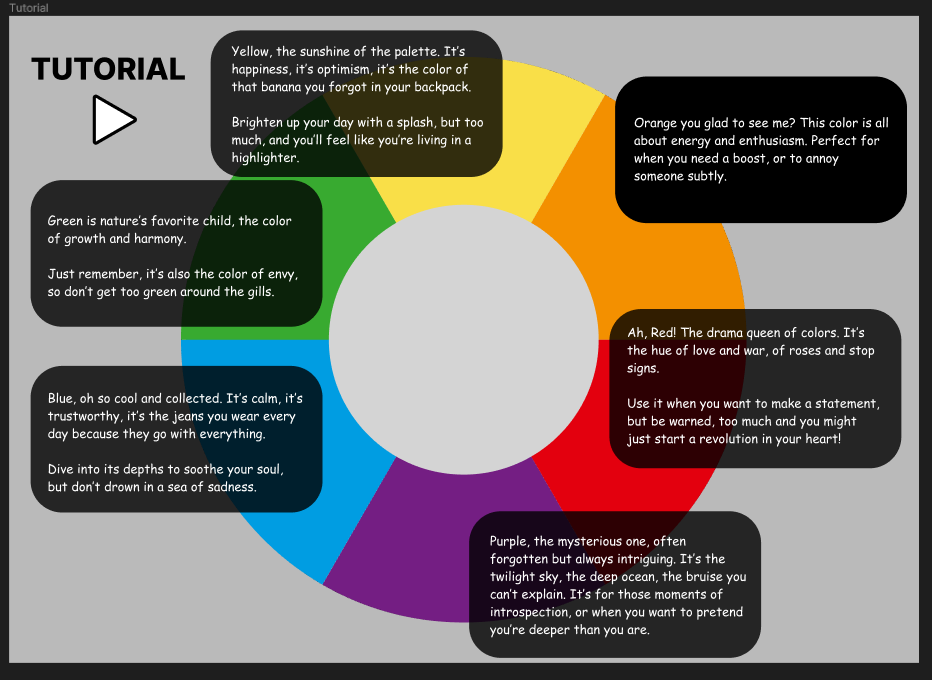
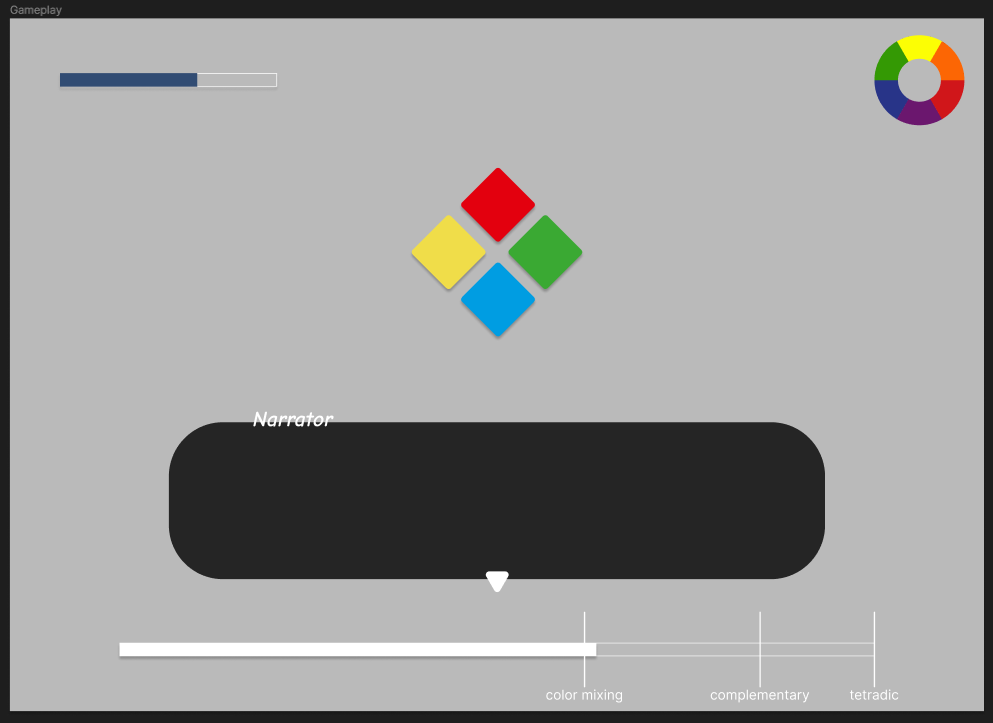

___
# Design Journal: Prototyping Stage 4
April 4, 2024

## Prototype 4
### Goals
My fourth prototype had a mix of higher fidelity and implementation. The plan was to make the game more complete by adding a health system to provide a win/ lose situation. However, for the most part of this week, I was trying to fix bugs that I hadn't noticed in my last prototype... The issue in question is that the single notes weren't detecting properly after they have switched colors, so I made the keyboard **match both colors and keys pressed** (the same way as how the double notes were coded).

Added visuals:
- Some texts are displayed on the lane so the player can tell the accuracy of their hits. 
- The UI layout was moved so the elements aren’t fighting for too much attention. For example, the **color switches** are moved closer to the play area so the users’ eyes don’t have to look far off screen to refer to it. The multiplier is also moved on the lane so they can keep track of their combo.

### Current Stage
So far I have the drafts for my character:
  

The lives are still being implemented in the game (delayed due to power outage from the snow storm...)

### Next Steps
- [x] Finish implementing the lives.
- > Game Over screen
- > Add Title screen + Restart/ Replay
    - [ ] Pause button maybeee??? [OPTIONAL]
      - Would need to figure how to pause music and game elements.
- [x] Draw character head + expressions sprites that react to hit accuracy. (Totally not needed but it's something I'd like to do!)
- [ ] Multiplier expand + fade out effect.
- [ ] Accuracy text drop effect.

___
# Design Journal: Prototyping Stage 3
March 28, 2024

## Prototype 3
### Goals
Focused on making the main game mechanic to work which is to have the keyboard switch colors and the mix-colored-notes be able to detect those keys even after they have been switched.
The music has also been changed.

Issues:  
I couldn't figure out how to make the the double notes detect 2 colors at the same time so I gave it an illusion of a "double" note by separating it into 2 single notes.

### Feedback
Adding obstacles, like colors that you 'shouldn’t' click on to make it more interesting. (Ex. Avoiding grayed out or wrong colors on the lane).

### Next Steps
For next week, I'll focus on implementing the lives and pause menu to wrap up the functionality of the game (role + implementation). I'll also improve the UI and add visuals for player feedback  (high fidelity + look/ feel).
- [ ] Add lives in the game manager.
- [ ] Add grey obstacles to avoid.
- [ ] visual feedback:
  - [x] OK, GOOD, PERFECT ratings.
  - [ ] character expressions (neutral, disappointed, ecstatic)
___
# Design Journal: Prototyping Stage 2
March 21, 2024

## Prototype 2
### Goals
For my second prototype, I  dropped the visual novel idea because I would have needed much more time to flesh out a story. Instead, I went with a rhythm game while also keeping the color theory aspect.
 
Since I wanted to test the color theory mechanics, the prototype is closer to a **low fidelity implementation** to test the possibilities of the mechanics through code.

https://github.com/Doumeki21/CART315/tree/main/Project/FinalProject

### Feedback
After play testing the game, some people have suggested speeding up the notes, probably so that waiting for them to come down won’t be as nerve wracking.

There were also suggestions to make the game more interesting to play such as:
- There could be an opening prompt at the beginning of each session that indicates a particular color or object that you should avoid. 
- There could be a level where you can mix any colors, one where you can’t mix a specific color, and another where you can’t mix 2 colors (and so on).
- Another suggestion is if there is plot, I could also incorporate the above rules to colors that a character likes or hate.

Reflections:
- Maybe raising the difficulty by adding more colors to mix and adding tetradic color combinations would make the game more interesting. (Ex. Going from 3 keys to 4 or 5.)
- I'm also thinking of including unusual mechanics to make the player multitask.

### Next Steps
- [x] Fiddle more with the BPM variable in Unity to change the note speed (while also matching the beat of the music).
- [x] Have the double notes fill the whole keyboard instead so the user will have to memorize the color combinations. (An added challenge.)
  - [ ] A color theory tutorial will be implemented to complement this part for the mechanics. (Using the color Wheel.)
  - [ ] Make the colors of the keyboard show at the top of the screen as well to have the player retain less info during gameplay.
- [ ] (Look/feel) Regarding player feedback in the game, it would be good to add some VFX or indicators for the player to know how accurately they’re hitting the notes. 
  - [x] Fixing the currently broken multiplier can also help see when they have missed.)
- [ ] Lastly, I could also consider adding sliders in the game but that could be optional.

___
# Design Journal: Prototyping Stage 1
March 14, 2024
 
Journal about the first stage of your prototyping process. What was your idea? What specific questions where you trying to answer (goals)? Was it a look/feel, role, implementation prototype? What fidelity levels are you dealing with? What did you learn and what are the next steps?

## Prototype 1

### Goals
My first stage of the prototype process was done using Twine. I mainly wanted to test how a basic interaction would flow with the narration. So it was more of a low to mid-fidelity prototype with a focus on the **role**.

[Link to first prototype: Twine project](https://Doumeki21.github.io/CART315/Process/cart315-prototype1.html)

### Feedback
After play testing, I received feedback on improving the narration direction, such as moving towards a linear story so that the audience can be more invested in the story and character development (instead of having to interact with multiple characters).

In terms of the “look and feel” aspect, I need to think more about the kinds of UI elements I will need, how can the player know which color represents which emotion, and how the puzzles are going to work...

### Next Steps
Because some people mentioned about needing a way to show the player how the color psychology works, I decided that it would be good idea to make a tutorial as my next step.
(But I think developing a gameplay sample would be better...)

The problem is I still haven't figured out precisely how I'm going to execute the theme through actual gameplay. So I'll expand on the concept:

- The game is about losing yourself and falling into conformity. While not putting color theory in a bad light, I want to use it as a tool /analogy for conveying this message.

- Other characteristics of the game:
  - Letting others define the player's self worth.
  - Player has low self esteem.
  - **The game proceeds by receiving praise from NPCs.**

_(Mock ups for the meantime.)_

___
# Design Journal: Conceptualizing
March 7th, 2024
 
Journal about your ideation process. Include any Design Values, Precedents, and your 3 favourite ideas. These don't have to be very detailed, just a few sentences to capture the main game concept.

## Conceptualizing: The Beginning
Before March break, we each had to do a conceptualizing exercise to come up with a list of game concepts. I mainly went with a mix of games that I enjoy playing and topics I would be interested in making. I’ve always been stuck on aesthetics and struggled to make meaningful work… so to make one, providing a theme and a good play experience can carry that. In addition, bringing emotion to the work can also help complement these 2 design values. Lastly, by adopting a minimal aesthetic, I can distribute the workload involved in developing the game.

### Idea 1
The first idea I had was to make a strategic rhythm game using color codes to manipulate creature behavior.
- **Comments:**
  - Designing creatures, coming up with all the behaviors of the animals, as well as timing to the beat would all be too ambitious for me to tackle in such a short period of time.

### Idea 2
The second idea (from combining a partner’s word) was a game set in a farm or slaughterhouse, chopping animals to the beat.
- **Comments:**
  - This idea seems more approachable than the first. The rhythm aspect contrasted with a slaughterhouse is quite dark, perhaps hinting at the inevitable end of the farm animals.
  - The rhythm aspect is still a bit too ambitious with the time frame I have, but it is a concept I would like to give it a try in the future.

### Idea 3
The third idea (from combining a partner’s word) was a game that uses colors as a communication tool to “decode” and manage emotions. (Difficulty can range from simply selecting colors on screen to mixing colors to match complex emotions.)
- **Comments:**
  - I have been attracted to color theory since my art journey and I think it could be used as an effective game mechanic in relation to understanding human emotions.
  - I have decided to focus on this concept in the upcoming weeks, acknowledging that it may not be perfect but holds personal significance for me.

___

# Design Journal: Game Analysis
February 17, 2024
 
Design Journal: Game Analysis - Find a game that you know well or are interested by. What decisions have the designers made that cause the game to be interesting? Where have they failed? Think mechanically rather than thematically. What ideas/methods/techniques do you think you could borrow for future projects?

## Game Analysis: Okami

Okami was one of my favorite games on the Wii console when it first came out. It's a game that falls into a mix of action, adventure, platform, and puzzle game genres. While my gaming experience was limited, it had unique game mechanics and gameplay like no other. For context, the story is set in Nippon, where you are the reincarnated God called Amaterasu, controlled as a wolf. The premise of the game is to collect all the brush techniques that you have lost and use them to fight off evil. 

### Interesting Points
- The brush mechanic
  - Amaterasu's tail is shaped like a brush which you can use to **draw** attacks on enemies. As a young teen, being able to manipulate my surroundings always fascinated me. You could draw a sun at night to create day, slice enemies with a stroke of a brush, slow time, or break through walls by dropping bombs. Even though you can "punch and kick" like in typical combat, the celestial brush provides for a dynamic play, both for combat and solving puzzles.
  - As a bonus, you can even sprout trees to stun enemies or pee on them to receive extra rewards. The incorporation of humor adds to the charm of Okami as well!
- Another interesting point is that most of the time, the difficulty of the game isn't about trying to survive, but about getting more rewards by ridding enemies the quickest and most **skillfully** as possible. 

### Flaws
 - Due to the amount of brush techniques to be learned in the game (about 13+), similarities in stroke design should be avoided. For example, both "Veil of Mist" and "Whirlwind" require the player to draw horizontal lines to activate the techniques, but one slows down time while the other creates a tornado. When the system misinterprets these brush strokes, it can cause lots of frustration- especially during a heated battle.

### For Inspiration...
- To incorporate some of these ideas in my future projects, I'd like to consider variety in gameplay. For example, I could match different actions to each of their corresponding opponents' colors or introduce different characters that have different playing styles. (If I do have time, I'd like to think a bit more about the choice of visual narrative as well.)

